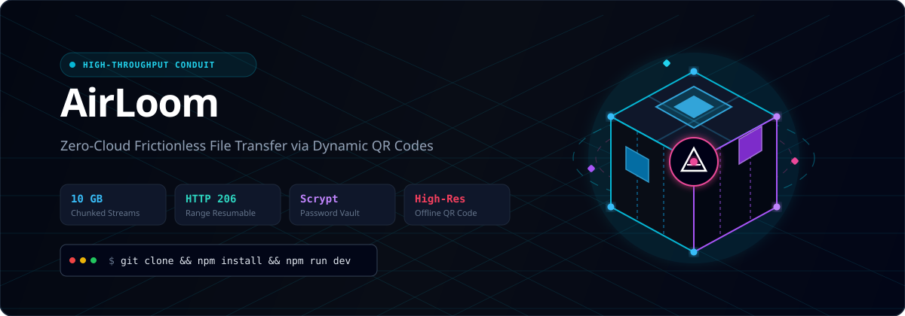
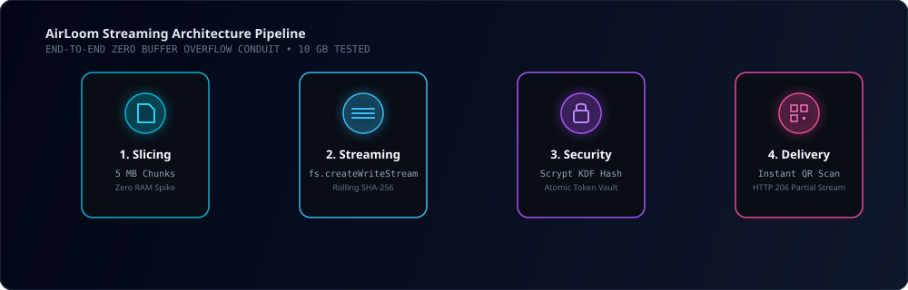

<div align="center">

# AirLoom
### High-Throughput Zero-Cloud File Transfer Conduit

<p align="center">
  
</p>

[](https://www.typescriptlang.org/)
[](https://react.dev/)
[](https://threejs.org/)
[](https://expressjs.com/)
[](#)
[](#)

<p align="center">
  <strong>Instant peer-to-peer file bridge. Upload massive files with chunked streaming, generate a high-contrast QR code, and let anyone download immediately from any mobile camera.</strong>
</p>

</div>

---

## ⚡ Table of Contents

- [3D Animated Architecture](#-3d-animated-architecture)
- [Key Features](#-key-features)
- [Zero RAM Spike Streaming Engine](#-zero-ram-spike-streaming-engine)
- [Security & Cryptography Model](#-security--cryptography-model)
- [QR Code Delivery Matrix](#-qr-code-delivery-matrix)
- [Quickstart & Development](#-quickstart--development)
- [REST API Reference](#-rest-api-reference)
- [License](#-license)

---

## 🔮 3D Animated Architecture

AirLoom replaces brittle single-payload HTTP transfers with a continuous chunked conduit. Files bypass standard Node.js memory buffers entirely and are written incrementally to disk:

<p align="center">
  
</p>

```
Browser (file.slice) ──[ 5 MB Chunks ]──> Express Bus ──> Direct WriteStream ──> Disk Storage
                                                                │
                                                        [ Rolling SHA-256 ]
                                                                │
QR Code Scanner <──[ HTTP 206 Partial Content ]── Scrypt Vault Checked
```

---

## 🚀 Key Features

- **10 GB Tested Throughput**: Tested with multi-gigabyte files without crashing browser tabs or exhausting Node.js heap memory.
- **Client-Side Slicing**: Slices files into 5 MB chunks via browser `Blob.slice()` with automatic retry and SHA-256 rolling integrity verification.
- **Resume & Seek Streaming (HTTP 206)**: Full support for HTTP range headers, enabling mobile users to seek into large video files or resume interrupted transfers.
- **High-Contrast QR Generation**: Instant vector QR code rendering with custom quiet zones, download mode toggle (bundled zip vs. individual files), and instant print poster generation.
- **Hardware-Hardened Scrypt KDF**: Optional password-protected vaults hashed via Node.js native `crypto.scrypt` with a 32-byte salt and constant-time comparison against brute-force attacks.
- **Self-Destructing Ephemeral Vaults**: Configure shares to expire after $N$ downloads (e.g. 1-time download) or a custom TTL (1 hour to 30 days).
- **Interactive 3D Visualizer**: Live Three.js interactive data node rendering floating quantum wireframes and real-time transfer telemetry.

---

## 🛡️ Zero RAM Spike Streaming Engine

Standard file upload backends fail on large transfers because libraries like `multer` or standard Express body parsers buffer the entire file in RAM:

```typescript
// Traditional failure mode (Crashes on 10 GB):
const fileBuffer = fs.readFileSync(uploadPath); // Out of memory!
```

### AirLoom Stream Pipeline
AirLoom initializes an upload session, assigns a dedicated temp target, and pipes each 5 MB multipart chunk directly into a persistent append stream:

1. **Upload Initialization (`POST /api/upload/init`)**: Allocates upload token and validates quota.
2. **Chunk Transmission (`POST /api/upload/chunk`)**: Pipes the 5 MB chunk directly to `fs.createWriteStream({ flags: 'a' })` while updating incremental byte counters.
3. **Assembly & Finalization (`POST /api/upload/complete`)**: Compares final size and commits the file record to the persistent vault.

---

## 🔒 Security & Cryptography Model

- **Scrypt Password Key Derivation**:
  ```ts
  crypto.scrypt(password, salt, 64, { N: 16384, r: 8, p: 1 }, (err, derivedKey) => {
    // Constant-time hash verification
  });
  ```
- **Rate-Limiting on Token Verification**: Throttles brute-force attempts on protected shares.
- **Atomic Disk Commits**: Share metadata is committed atomically to eliminate database corruption risks.
- **No Unsolicited Network Calls**: Transfer pipeline remains completely self-contained and private.

---

## 📱 QR Code Delivery Matrix

When an upload completes, AirLoom synthesizes a high-contrast QR code directly in SVG and Canvas formats:

- **Mobile Camera Instant Recognition**: Calibrated quiet-zone padding and dark module ratios ensure recognition by iOS Camera and Android Lens even on dim OLED displays.
- **Mode Toggle**: Senders can configure the QR destination to bundle all uploaded assets into a single streaming ZIP or expose a selective file browser.
- **One-Click Print Template**: Generates print-ready vector transfer flyers for live event distribution or classroom air-drops.

---

## 💻 Quickstart & Development

### Prerequisites
- Node.js 18.0 or higher
- npm 9.0 or higher

### Installation
```bash
# Clone the repository
git clone https://github.com/your-username/airloom.git
cd airloom

# Install dependencies
npm install

# Launch development server (Port 3000)
npm run dev
```

### Production Build
```bash
# Compile client assets with Vite and bundle backend with esbuild
npm run build

# Start production server
npm start
```

---

## 📡 REST API Reference

| Method | Endpoint | Description |
| :--- | :--- | :--- |
| `POST` | `/api/upload/init` | Initiates chunked session with file manifest |
| `POST` | `/api/upload/chunk` | Streams a single 5 MB file chunk directly to disk |
| `POST` | `/api/upload/complete` | Finalizes upload and computes SHA-256 integrity |
| `POST` | `/api/shares` | Creates a new QR share vault with optional password |
| `GET` | `/api/shares/:token` | Retrieves share metadata and file manifest |
| `POST` | `/api/shares/:token/unlock` | Validates password with Scrypt KDF |
| `GET` | `/api/shares/:token/download/:fileId` | Streams specific file with HTTP 206 support |
| `GET` | `/api/shares/:token/download-all` | Dynamically streams a ZIP bundle of all files |
| `GET` | `/api/dashboard/shares` | Retrieves all active shares for local manager |
| `POST` | `/api/dashboard/cleanup` | Purges expired shares and dangling chunks |

---

## 📄 License

MIT License © 2026 AirLoom. Built for maximum speed, security, and zero-cloud friction.
